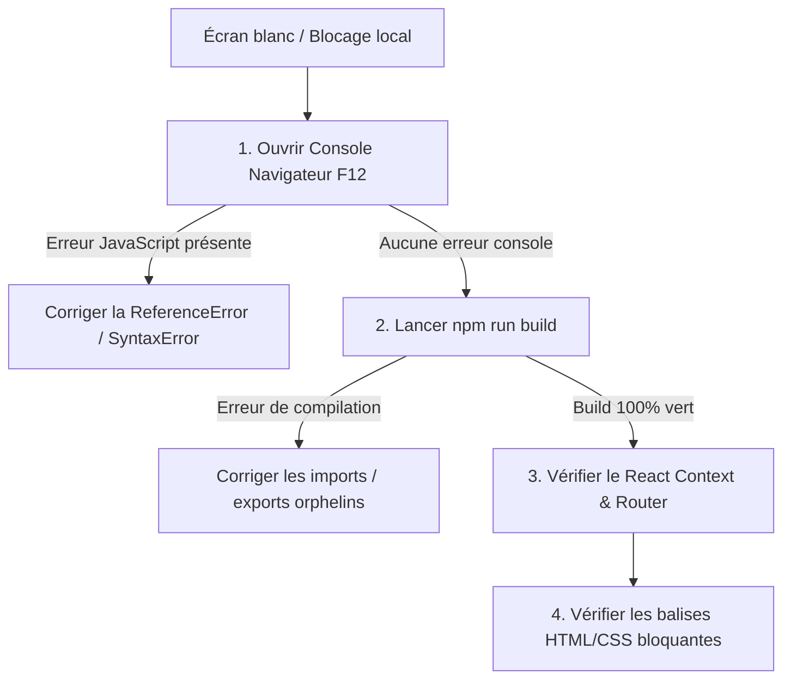

# 📋 Post-Mortem & Guide de Diagnostic Technique — LUCENTE Milano

Ce document détaille l'incident de l'**écran blanc (white screen of death) / blocage au démarrage local**, les **fausses pistes explorées en vain**, les **causes racines identifiées**, ainsi que la **méthodologie de diagnostic standardisée** à appliquer immédiatement lors de futurs incidents.

---

## 1. Description du Problème Initial

* **Symptôme** : Le serveur de développement Vite tournait localement (`http://localhost:5173` ou `5174`), le fichier `index.html` était bien servi (HTTP 200), mais le navigateur affichait une page entièrement blanche / vide.
* **Impact** : Impossibilité de voir le site en local, blocage critique empêchant la validation et le déploiement en production.

---

## 2. Les Fausses Pistes et Méthodes Tentées en Vain

Lors du diagnostic initial, plusieurs hypothèses incorrectes ont fait perdre du temps avant d'isoler le vrai problème :

| Hypothèse Testée | Pourquoi c'était une fausse piste |
|---|---|
| **Problème de Port / Réseau Vite** | Redémarrer le serveur Vite sur d'autres ports (5174, 5175) et suspecter un conflit de port Windows / firewall. Le serveur répondait en réalité parfaitement (HTTP 200). |
| **Écran de chargement / Modal bloquant l'affichage** | Penser qu'un composant fixed (`LoadingScreen`, `ReservationModal`) avec `z-50` ou `pointer-events-none` couvrait l'écran en noir ou bloquait le rendu. En réalité, React ne rendait même pas ces composants. |
| **Blocage du Lazy Loading / Suspense** | Suspecter que `React.lazy` ou `Suspense` était bloqué en attente indéfinie d'un chunk JavaScript. |
| **Recherche manuelle dans le CSS / Tailwind** | Chercher des classes `opacity-0`, `hidden`, `h-0` dans le code au lieu de vérifier les logs runtime. |

> **Leçon apprise** : Ne jamais chercher des causes réseau ou de style CSS tant que les **erreurs JavaScript runtime du navigateur** n'ont pas été vérifiées.

---

## 3. Les Vraies Causes Racines

L'écran blanc était causé par un **crash fatal de l'arbre de rendu React (React Render Phase Crash)** dû à des erreurs JavaScript non capturées :

### Cause 1 : Imports React Router & Icônes Manquants (`ReferenceError`)
* **Fichiers** : `src/pages/HomePage.jsx` et `src/pages/GalleryPage.jsx`
* **Problème** : Le composant `<Link>` de `react-router-dom` et plusieurs icônes Lucide (`Award`, `ChevronDown`, `ArrowRight`, `Feather`) étaient utilisés dans le JSX sans être importés en haut du fichier.
* **Conséquence** : Dès que React tentait de monter `HomePage`, une exception `Uncaught ReferenceError: Link is not defined` était levée, détruisant instantanément tout l'arbre DOM React sans afficher de fallback.

### Cause 2 : Destructuration Incomplète du Contexte i18n (`useLanguage`)
* **Fichiers** : `src/components/Footer.jsx` et `src/pages/MenuPage.jsx`
* **Problème** : Le composant appelait `const { t } = useLanguage()` au lieu de `const { lang, t } = useLanguage()`, alors que le JSX évaluait des ternaires du type `{lang === 'it' ? ... : ...}`.
* **Conséquence** : `ReferenceError: lang is not defined` dès l'évaluation du composant.

### Cause 3 : Composant non rendu dans le JSX (`LoadingScreen`)
* **Fichier** : `src/App.jsx`
* **Problème** : `LoadingScreen` était importé mais n'avait pas été placé dans le JSX retourné par `App()`, ce qui faisait disparaître l'écran d'introduction attendu par l'utilisateur.

---

## 4. Les Méthodes qui ont Résolu le Problème

1. **Console DevTools du Navigateur** :
   La consultation directe des logs de la console JavaScript du navigateur a immédiatement exposé l'erreur exacte :
   ```text
   Uncaught ReferenceError: Link is not defined at HomePage (HomePage.jsx:246)
   ```
2. **Analyse Automatisée via Linter (`oxlint` / `eslint`)** :
   L'exécution d'un scan avec détection des variables JSX non définies (`jsx-no-undef`) a permis de lister en une seule commande tous les fichiers affectés :
   ```bash
   npx oxlint --deny jsx-no-undef
   ```
3. **Validation par Build de Production (`vite build`)** :
   L'exécution de `npm run build` compile l'AST complet et valide qu'il n'y a aucun import orphelin, variable non résolue ou erreur de syntaxe :
   ```bash
   npm run build
   ```

---

## 5. Protocole de Diagnostic Standardisé (Checklist Future)

Lorsqu'un écran blanc ou un blocage survient, suivre **strictement** ces étapes dans l'ordre :



### Checklist d'intervention :
- [ ] **Étape 1 : Ouvrir les DevTools (F12 -> Onglet Console)**
  - Lire la première ligne rouge (la source du crash est toujours la première erreur levée).
- [ ] **Étape 2 : Lancer `npm run build` dans le terminal**
  - Si le build échoue, l'erreur exacte avec le numéro de ligne est affichée directement.
- [ ] **Étape 3 : Lancer un scan rapide des variables non définies**
  - `npx oxlint` pour trouver les composants JSX manquants d'imports.
- [ ] **Étape 4 : Vérifier les hooks de contexte (`useLanguage`, etc.)**
  - S'assurer que toutes les variables consommées (`lang`, `t`, etc.) sont bien destructurées.
- [ ] **Étape 5 : Prévoir un Error Boundary React**
  - Encapsuler l'application dans un composant `<ErrorBoundary>` pour afficher une interface de secours propre avec le message d'erreur plutôt qu'un écran blanc.
